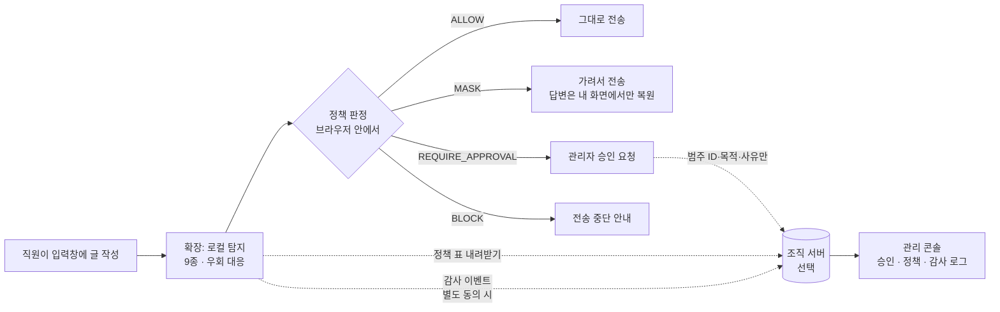

<div align="center">


# AI 입력정보 보호 게이트웨이

**ChatGPT·Claude·Gemini에 글을 보내기 *직전에* 개인정보·비밀키를 검사하고, 가려서 보내게 도와주는 크롬 확장 프로그램**
(+ 조직이 규칙·승인·기록을 관리하는 선택형 서버)

[사용법 홈페이지](https://dyj02056.github.io/ai-input-protection-gateway/) ·
[로컬 탐지 데모](https://dyj02056.github.io/ai-input-protection-gateway/demo.html) ·
[개인정보 처리방침](https://dyj02056.github.io/ai-input-protection-gateway/privacy.html) ·
[계획서](documents/plan.md)

`Chrome MV3` · `TypeScript / React(Preact)` · `Python FastAPI` · `v1.7.0`

</div>

---

## 목차
1. [왜 만들었나요](#1-왜-만들었나요)
2. [무엇을 해 주나요](#2-무엇을-해-주나요)
3. [어떻게 동작하나요](#3-어떻게-동작하나요)
4. [1분 만에 써 보기 (확장 설치)](#4-1분-만에-써-보기-확장-설치)
5. [판정 4단계와 기본 정책](#5-판정-4단계와-기본-정책)
6. [조직 서버 연결 (선택)](#6-조직-서버-연결-선택)
7. [개인정보·보안 원칙](#7-개인정보보안-원칙)
8. [저장소 구조](#8-저장소-구조)
9. [개발과 테스트](#9-개발과-테스트)
10. [현재 한계와 다음 단계](#10-현재-한계와-다음-단계)
11. [문서 모음](#11-문서-모음)

---

## 1. 왜 만들었나요

직원들이 업무 속도를 위해 고객 목록, 계약서, 소스코드, API 키를 외부 생성형 AI에 그대로 붙여넣는 일이 흔합니다. 사내 규정과 교육만으로는 **보내는 그 순간**을 막을 수 없고, 전부 차단하면 사람들이 개인 계정으로 우회합니다.

이 프로젝트는 "막기만 하는 도구"가 아니라 **안전하게 통과시키는 경로**(마스킹·승인)를 함께 제공해, 직원이 통제 경로 안에 머물도록 하는 것을 목표로 합니다. 설계 전체는 [`documents/plan.md`](documents/plan.md)에 있습니다.

## 2. 무엇을 해 주나요

| 기능 | 설명 |
|---|---|
| **전송 전 검사** | 입력·붙여넣기·첨부파일을 보내기 전에 검사합니다. 검사는 **브라우저 안에서만** 합니다 |
| **9종 형식 탐지** | 주민등록번호, 전화번호, 이메일, API 키·토큰, 카드번호, 계좌번호, 여권번호, 운전면허번호, 비밀번호 |
| **우회 대응** | 전각 문자, 보이지 않는 문자, 한글로 쓴 숫자, URL·Base64 인코딩으로 숨긴 값도 풀어서 검사 |
| **마스킹과 복원** | 민감한 부분만 `[전화번호]`로 가리거나, `[전화_1]` 같은 **세션 토큰**으로 바꾸고 AI 답변에서는 **내 화면에서만** 원래 값으로 보여 줌 |
| **첨부파일 검사** | txt · csv · docx · xlsx · hwpx 내용을 로컬에서 검사 (표의 행 수로 대량 반출도 판단) |
| **4단계 판정** | 허용 / 마스킹 / 승인 필요 / 차단 — 설정으로 실제 전송 차단까지 가능 (기본은 안내만) |
| **조직 정책 서버** *(선택)* | 정책 표 배포, 정책 버전 관리·롤백, 감사 이벤트 수집(해시 체인), 관리자 승인 요청 처리, 관리 콘솔 |
| **원문 미저장** | 입력 원문·파일 이름·사이트 주소는 어떤 서버에도 보내거나 저장하지 않습니다 |

## 3. 어떻게 동작하나요



- **확장(PEP, 집행 지점)**: 입력을 가로채 안내하고 조치를 집행합니다. 서버 없이도 모든 기본 기능이 동작합니다.
- **서버(PDP, 판정 지점)**: 정책을 **내려주는** 쪽입니다. 판정은 이벤트 핸들러 안에서 동기적으로 해야 하고 요청마다 서버에 물으면 메타데이터가 새기 때문에, 확장이 정책 표를 받아 와 브라우저 안에서 판정합니다.
- 서버로 가는 것은 **범주 ID·조치 이름·시각·정책 버전**, 그리고 승인 요청 시의 **업무 목적·짧은 사유**뿐입니다.

## 4. 1분 만에 써 보기 (확장 설치)

필요한 것: Node.js 20.19 이상, Chrome(또는 Edge).

```bash
npm install
npm run build        # 확장을 dist-ext/ 폴더에 만듭니다
```

1. 크롬 주소창에 `chrome://extensions` 입력
2. 오른쪽 위 **개발자 모드** 켜기
3. **압축해제된 확장 프로그램을 로드합니다** → **`dist-ext/`** 폴더 선택 (소스 폴더 `browser-extension/`가 아닙니다)
4. ChatGPT·Claude·Gemini를 열고 입력창에 **가짜 값**을 붙여넣어 봅니다.

```text
가짜 전화번호 010-0000-0000
가짜 이메일 test.user@example.com
가짜 키 sk-TESTTESTTESTTESTTEST
```

→ 오른쪽 위에 안내창이 뜨고, **감지 항목 마스킹** 버튼으로 가릴 수 있습니다. 실행 취소도 됩니다.

> 기본값에서는 **아무것도 막지 않고 알려 주기만** 합니다. 전송 차단·승인 확인은 확장 옵션에서 직접 켜야 동작합니다. **실제 개인정보를 넣어 시험하지 마세요.**

브라우저 없이 탐지 결과만 보고 싶다면 [로컬 탐지 데모](https://dyj02056.github.io/ai-input-protection-gateway/demo.html)를 이용하세요.

## 5. 판정 4단계와 기본 정책

| 판정 | 의미 |
|---|---|
| `ALLOW` | 그대로 보내도 됩니다 |
| `MASK` | 민감한 부분만 가려서 보냅니다 |
| `REQUIRE_APPROVAL` | 관리자의 승인이 필요합니다 |
| `BLOCK` | 보내면 안 되는 정보입니다 |

여러 항목이 함께 감지되면 **가장 엄격한 판정**을 따릅니다 (`BLOCK > REQUIRE_APPROVAL > MASK > ALLOW`).

| 감지 항목 | 기본 판정 | 감지 항목 | 기본 판정 |
|---|---|---|---|
| 주민등록번호 | MASK | 카드번호 | **BLOCK** |
| 전화번호 | MASK | 계좌번호 | MASK |
| 이메일 | MASK | 여권번호 | MASK |
| API 키/토큰 | **BLOCK** | 운전면허번호 | MASK |
| 비밀번호 | **BLOCK** | 등록되지 않은 항목 | REQUIRE_APPROVAL |

조직 서버를 연결하면 이 표를 콘솔에서 바꿀 수 있습니다. 단, **API 키·카드번호·비밀번호는 BLOCK보다 약하게 바꿀 수 없습니다.**

## 6. 조직 서버 연결 (선택)

서버는 "회사 차원에서 규칙을 통일하고 기록·승인을 관리하고 싶을 때" 추가합니다. Python 3.10 이상이 필요합니다.

```bash
py tools/server.py setup                          # 가상환경 + 의존성 설치
py tools/server.py newkey --name my-user          # 직원용 키 (확장에 입력)
py tools/server.py newkey --admin --name my-admin # 관리자 키 (콘솔 로그인용)
```

각 명령은 **키 본체**(한 번만 보여 줌)와 **해시 줄**을 출력합니다. 해시 줄은 `gateway-core/server/.env`에, 키 본체는 쓰는 곳(확장 옵션·콘솔)에 넣습니다.

```dotenv
# gateway-core/server/.env  (커밋되지 않음)
PDP_API_KEYS_SHA256=my-user=<64자리 해시>
PDP_ADMIN_KEYS_SHA256=my-admin=<64자리 해시>
```

```bash
py tools/server.py run                            # http://127.0.0.1:8787
```

| 하는 일 | 방법 |
|---|---|
| **관리 콘솔 열기** | 브라우저에서 `http://127.0.0.1:8787/console` → **관리자 키 본체** 입력 |
| **확장 연결** | 확장 옵션 → *조직 정책 서버* → 주소와 **일반 키 본체** 입력 → *연결하고 정책 받기* |
| **감사 이벤트 전송** | 옵션에서 별도 스위치를 켠 경우에만 (기본 꺼짐) |
| **관리자 승인 요청** | 옵션에서 별도 스위치를 켠 경우에만 (기본 꺼짐) |

**관리 콘솔 탭**

| 탭 | 기능 |
|---|---|
| 승인함 | 직원의 승인 요청을 건별로 승인·거절 |
| 정책 | 새 정책 버전 만들기, 바로 적용, 이전 버전으로 되돌리기 |
| 감사 로그 | 확장이 보낸 이벤트 조회, 해시 체인 검증 |
| 관리 기록 | 정책 변경·승인 처리 기록과 체인 검증 |

**승인 흐름**: 승인 필요 판정 → 전송 중단 → 직원이 업무 목적을 골라 요청 → 관리자 승인 → 직원이 내용을 **바꾸지 않고** 다시 보내면 **딱 한 번** 통과. 한 글자라도 바꾸거나 같은 승인으로 두 번 보내면 막힙니다. 서버가 응답하지 않아도 승인 없이는 통과하지 않습니다.

서버 상세(API·환경 변수·보안 설계·운영 전 할 일)는 [`gateway-core/server/README.md`](gateway-core/server/README.md)를 보세요.

## 7. 개인정보·보안 원칙

- **검사는 전부 로컬**: 입력한 글과 파일은 브라우저 밖으로 나가지 않습니다.
- **기본은 네트워크 요청 0건**: 서버를 연결하지 않으면 확장은 어떤 요청도 보내지 않습니다.
- **서버로 가는 것은 별도 동의 후, 최소한만**: 범주 ID·조치·시각·정책 버전, 승인 요청 시 업무 목적·짧은 사유. 입력 원문·파일 이름·사이트 주소·감지 건수는 보내지 않습니다 (테스트가 보내는 항목 목록을 고정해 검사합니다).
- **API 키는 코드·설정 파일·저장소에 두지 않습니다**: 서버는 환경 변수의 **해시**만 가지고, 확장은 사용자가 직접 입력한 키를 브라우저 저장소에만 둡니다. 이 저장소는 공개이며 키 형식 노출을 검사하는 테스트가 있습니다.
- **감사 기록 위·변조 탐지**: 이벤트를 해시 체인으로 쌓고 관리자 키로만 읽고 검증합니다.
- **권한 최소화**: `storage` + 지원 사이트 4곳. 서버 접근 권한은 연결할 때만 브라우저가 묻습니다.

자세한 내용은 [개인정보 처리방침](https://dyj02056.github.io/ai-input-protection-gateway/privacy.html)을 보세요.

## 8. 저장소 구조

```text
.
├─ browser-extension/      Chrome MV3 확장 (TypeScript, React/Preact)
│  ├─ manifest.json
│  └─ src/
│     ├─ engine/           탐지기(detector)·정책 엔진(policy)
│     ├─ content/          입력 검사·안내창·마스킹·전송 차단·승인 흐름·첨부파일 검사
│     ├─ background/       서비스 워커: 정책 동기화·감사 전송·승인 요청 (네트워크는 여기서만)
│     ├─ options/ popup/ onboarding/   설정·팝업·시작 화면
│     └─ shared/           카테고리 등록부, 서버 정책·승인 공통 정의
├─ gateway-core/
│  ├─ pdp/                 Python 정책 판정 엔진 (원문 없이 범주 ID로 판정)
│  └─ server/              FastAPI 서버: 정책·승인·감사 로그·관리 콘솔(console/)
├─ site/                   공개 사이트 소스 (Astro)
├─ docs/                   사이트 빌드 결과물 (GitHub Pages가 배포) — 직접 고치지 않음
├─ documents/              계획서(plan.md), 스토어 등재 문안
├─ tools/                  서버 실행·키 생성·정책 대조·DOM 시험·스토어 패키징 스크립트
└─ scripts/build.mjs       확장 빌드
```

## 9. 개발과 테스트

```bash
npm install
npm run build                      # 확장 빌드 (dist-ext/)
npm test                           # 빌드 후 vitest 전체
py tools/server.py setup           # 서버 가상환경 (처음 한 번)
py tools/server.py test            # 서버 단위 시험
py tools/server.py e2e             # 서버를 임시 키로 띄워 확장 코드와 실제 HTTP로 연결
py tools/dom_test.py               # 실제 Chrome(헤드리스) DOM 시험 — npm run build 선행
py tools/policy_parity.py          # 확장 정책 ↔ Python PDP ↔ 서버가 같은 판정을 내는지 대조
py -m unittest discover -s gateway-core/pdp
py tools/package_store.py          # 스토어 제출용 ZIP (dist/)
npm run build:docs                 # site/ → docs/ (사이트 빌드, Node 22.12 이상)
```

| 검사 | 현재 결과 |
|---|---|
| vitest (확장·화면·산출물) | 964 통과 |
| 서버 단위 시험 | 84 통과 |
| 서버 + 확장 실제 연동(e2e) | 13 통과 |
| 정책 대조 | 40/40 |
| 실제 Chrome DOM 시험 | 65/65 |

## 10. 현재 한계와 다음 단계

**한계 (정직하게)**
- 정규식·형식 기반 탐지라 **오탐과 누락이 있습니다.** 감지되지 않았다고 안전한 것은 아닙니다. 이름·주소 탐지(NER)는 아직 없습니다.
- ChatGPT·Claude·Gemini **실제 화면에서의 동작은 자동 시험으로 검증하지 못했습니다.** 사이트가 바뀌면 입력창·답변 위치 인식이 달라질 수 있습니다.
- 서버는 **로컬 개발·시연용**입니다. TLS, 속도 제한, 사용자별 키·SSO, DB가 없고 키는 조직당 하나입니다.
- 승인 요청은 **텍스트 입력만** 대상이며, PDF 내용·이미지(OCR) 검사는 아직 없습니다.

**다음 후보**: 사용자별 키·SSO, 감사 로그 외부 앵커링, API 프록시(사내 챗봇 통제), PDF·OCR, 이름·주소 탐지, 실제 사이트 선택자 검증.

## 11. 문서 모음

| 문서 | 내용 |
|---|---|
| [`documents/plan.md`](documents/plan.md) | 전체 설계 계획서 (위협 모델, 정책 의미론, 아키텍처, 로드맵) |
| [`browser-extension/README.md`](browser-extension/README.md) | 확장 구조와 버전별 변경 내용 |
| [`gateway-core/server/README.md`](gateway-core/server/README.md) | 서버 API·환경 변수·승인 워크플로·관리 콘솔·보안 설계 |
| [`gateway-core/pdp/README.md`](gateway-core/pdp/README.md) | Python 정책 엔진 |
| [`documents/store-listing.md`](documents/store-listing.md) | Chrome 웹 스토어 등재 문안과 권한 사유 |
| [`site/README.md`](site/README.md) | 공개 사이트 빌드 방법 |

> **주의**: 이 프로젝트는 교육·시연 목적의 프로토타입입니다. 실제 업무 데이터 보호의 유일한 수단으로 쓰지 마세요.
